# Architecture Diagram 1: Business Value Flow
# For Executives and Business Stakeholders

```mermaid
graph LR
    subgraph "GTM Pain Points"
        P1[Manual Reporting<br/>8 hrs/week]
        P2[Slow Campaign<br/>Execution<br/>12 hrs/campaign]
        P3[Reactive<br/>Support<br/>4-6 hr response]
        P4[Fragmented<br/>Data Silos]
    end
    
    subgraph "AI Control Room Solution"
        CR[🎛️ Control Room<br/>Dashboard]
        
        subgraph "Intelligent Agents"
            MA[🎨 Marketing<br/>Agent]
            FA[💰 Finance<br/>Agent]
            IA[📈 Insights<br/>Agent]
            SA[🎧 Support<br/>Agent]
        end
        
        CR --> MA
        CR --> FA
        CR --> IA
        CR --> SA
    end
    
    subgraph "Business Outcomes"
        O1[⚡ Real-time Reports<br/>15 min/week<br/><b>94% time saved</b>]
        O2[🚀 Auto Campaigns<br/>30 min/campaign<br/><b>96% time saved</b>]
        O3[🎯 Instant Answers<br/>&lt;30 sec response<br/><b>99% time saved</b>]
        O4[🔗 Unified Data<br/>Single view]
    end
    
    subgraph "ROI Impact"
        ROI1[💵 $39,200/month<br/>savings]
        ROI2[⚙️ 4 FTE<br/>equivalent]
        ROI3[📊 98% cost<br/>reduction]
    end
    
    P1 --> CR
    P2 --> CR
    P3 --> CR
    P4 --> CR
    
    MA --> O2
    FA --> O1
    IA --> O4
    SA --> O3
    
    O1 --> ROI1
    O2 --> ROI2
    O3 --> ROI1
    O4 --> ROI3
    
    style CR fill:#50E3C2,stroke:#000,stroke-width:3px
    style MA fill:#FFB6C1,stroke:#000,stroke-width:2px
    style FA fill:#98FB98,stroke:#000,stroke-width:2px
    style IA fill:#87CEEB,stroke:#000,stroke-width:2px
    style SA fill:#DDA0DD,stroke:#000,stroke-width:2px
    style ROI1 fill:#FFD700,stroke:#000,stroke-width:3px
    style ROI2 fill:#FFD700,stroke:#000,stroke-width:3px
    style ROI3 fill:#FFD700,stroke:#000,stroke-width:3px
```



## Key Metrics Dashboard

| Before AI | After AI | Improvement |
|-----------|----------|-------------|
| 8 hrs/week reporting | 15 min/week | **94% faster** |
| 12 hrs per campaign | 30 min per campaign | **96% faster** |
| 4-6 hr support response | <30 seconds | **99% faster** |
| **$40K/month in labor** | **$800/month** | **98% reduction** |

## ROI Breakdown

```
Annual Impact:
━━━━━━━━━━━━━━━━━━━━━━━━━━━━━━━━━━━━
Cost Savings:        $470,400/year
Revenue Impact:      +15% (faster GTM)
Team Efficiency:     4 FTEs redeployed
━━━━━━━━━━━━━━━━━━━━━━━━━━━━━━━━━━━━
Total Value:         $600K+ annually
```
