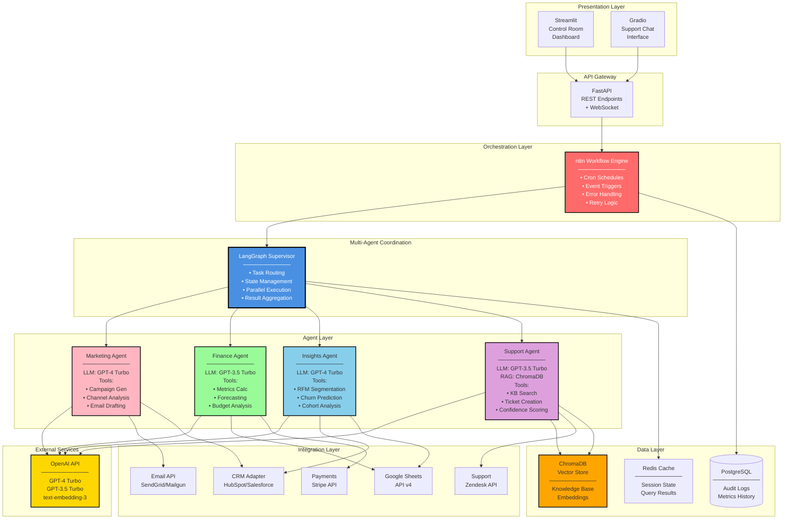

# Architecture Diagram 2: Technical System Architecture
# For Engineering and Technical Stakeholders



## Technology Stack Details

### Frontend
- **Streamlit**: Python-based web framework for data apps
- **Gradio**: ML model interface for support chat
- **Plotly**: Interactive visualizations

### Backend
- **FastAPI**: High-performance async API framework
- **LangChain/LangGraph**: Multi-agent orchestration
- **n8n**: Workflow automation and scheduling

### LLMs
- **GPT-4 Turbo**: Creative/complex reasoning tasks
  - Marketing content generation
  - Customer insight analysis
- **GPT-3.5 Turbo**: Fast/structured tasks
  - Financial calculations
  - Support query responses
- **text-embedding-3**: Vector embeddings for RAG

### Data Storage
- **ChromaDB**: Vector database for semantic search
- **Redis**: In-memory cache for sessions
- **PostgreSQL**: Relational DB for audit logs
- **Google Sheets**: Lightweight data storage/sharing

### Integrations
- **Email**: SendGrid, Mailgun
- **CRM**: HubSpot, Salesforce (adapter pattern)
- **Payments**: Stripe
- **Support**: Zendesk

## Data Flow Patterns

### 1. Real-time Query Flow
```
User Input → API → Supervisor → Agent → LLM → Tools → Response
                                    ↓
                                  Cache (for 1 hour)
```

### 2. Scheduled Workflow Flow
```
Cron Trigger → n8n → Supervisor → Parallel Agents → Aggregate → Sheets
                                         ↓
                                    DB Log (audit)
```

### 3. RAG-Enhanced Support Flow
```
Question → Support Agent → Vector Search → Context + Question → LLM → Answer
                               ↓
                         ChromaDB (semantic search)
```

## Deployment Architecture

```
┌──────────────────────────────────────────────────────────────┐
│                     Cloud Infrastructure                      │
│  ┌────────────────┐  ┌────────────────┐  ┌────────────────┐ │
│  │  GCP Cloud Run │  │ Railway / Fly  │  │ Streamlit Cloud│ │
│  │  ─────────────│  │  ─────────────│  │  ──────────────│ │
│  │  • n8n         │  │  • FastAPI     │  │  • Dashboard   │ │
│  │  • Agents      │  │  • Redis       │  │  • Auth        │ │
│  │  • ChromaDB    │  │                │  │                │ │
│  └────────────────┘  └────────────────┘  └────────────────┘ │
│                                                               │
│  ┌────────────────────────────────────────────────────────┐ │
│  │            Vercel (Static Site)                         │ │
│  │            • Public landing page                        │ │
│  │            • Architecture diagrams                      │ │
│  │            • Demo video                                 │ │
│  └────────────────────────────────────────────────────────┘ │
└──────────────────────────────────────────────────────────────┘
```

## Security Architecture

```
┌─────────────────────────────────────────────────────────┐
│                    Security Layers                       │
├─────────────────────────────────────────────────────────┤
│ 1. API Authentication: Bearer tokens, rate limiting     │
│ 2. Data Encryption: TLS 1.3, at-rest encryption         │
│ 3. Secret Management: Environment variables, Vault      │
│ 4. Access Control: RBAC, least privilege                │
│ 5. Audit Logging: All API calls logged to PostgreSQL    │
│ 6. PII Anonymization: Automated redaction in logs       │
└─────────────────────────────────────────────────────────┘
```

## Scalability Metrics

| Component | Current Capacity | Scale Target | Strategy |
|-----------|-----------------|--------------|----------|
| **API** | 100 req/min | 10K req/min | Horizontal + CDN |
| **Agents** | 10 concurrent | 100 concurrent | Worker pool |
| **DB** | 100K records | 10M records | Sharding |
| **Cache** | 1GB | 10GB | Redis cluster |
