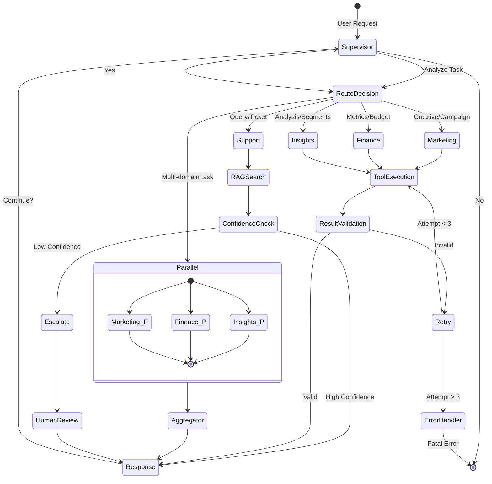
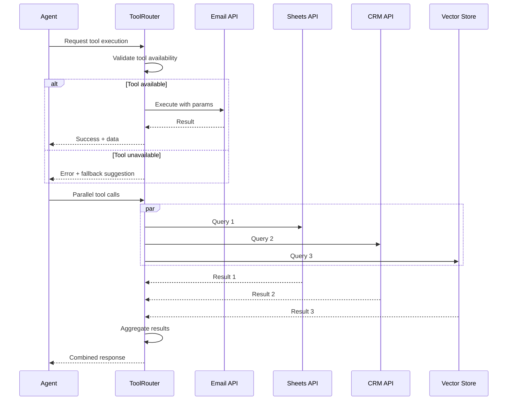

# Architecture Diagram 3: Multi-Agent Deep Dive
# For AI Engineers and System Architects

## LangGraph State Machine



## Agent Specialization Matrix

| Agent | LLM | Temperature | Max Tokens | Tools | Use Case |
|-------|-----|-------------|------------|-------|----------|
| **Marketing** | GPT-4 Turbo | 0.7 | 2000 | • Campaign Gen<br>• Email Draft<br>• Channel Analytics | Creative content, brand voice |
| **Finance** | GPT-3.5 Turbo | 0.1 | 500 | • Calc Engine<br>• Sheets Query<br>• Forecast Model | Structured calculations |
| **Insights** | GPT-4 Turbo | 0.3 | 1500 | • RFM Model<br>• Churn Predictor<br>• Cohort Analyzer | Pattern recognition |
| **Support** | GPT-3.5 Turbo | 0.2 | 800 | • Vector Search<br>• Ticket API<br>• Confidence Score | Fast, accurate responses |

## Supervisor Routing Logic

```python
class SupervisorAgent:
    def route_task(self, user_input: str, context: dict) -> str:
        """
        Routing Decision Tree:
        
        1. Keyword Analysis
           - "campaign", "email", "content" → Marketing
           - "revenue", "budget", "CAC" → Finance
           - "churn", "segment", "cohort" → Insights
           - "question", "help", "policy" → Support
        
        2. Intent Classification (via LLM)
           - Creative → Marketing
           - Analytical → Finance/Insights
           - Informational → Support
        
        3. Multi-Agent Detection
           - "weekly report" → Parallel (all agents)
           - "win-back campaign" → Sequential (Insights → Marketing → Finance)
        """
        
        # Keyword matching
        keywords = self._extract_keywords(user_input)
        
        # Intent classification
        intent = self._classify_intent(user_input)
        
        # Route decision
        if "weekly" in keywords or "all" in keywords:
            return "parallel"
        elif "campaign" in keywords:
            return "sequential:insights,marketing,finance"
        elif any(k in keywords for k in ["revenue", "cac", "ltv"]):
            return "finance"
        elif any(k in keywords for k in ["churn", "segment", "rfm"]):
            return "insights"
        elif any(k in keywords for k in ["help", "question", "policy"]):
            return "support"
        else:
            return "marketing"  # Default creative
```

## State Management Schema

```python
from typing import TypedDict, List, Dict, Optional
from enum import Enum

class AgentType(Enum):
    MARKETING = "marketing"
    FINANCE = "finance"
    INSIGHTS = "insights"
    SUPPORT = "support"

class AgentState(TypedDict):
    # Core state
    messages: List[str]              # Conversation history
    current_agent: Optional[AgentType]
    next_agent: Optional[AgentType]
    
    # Shared data (passed between agents)
    customer_ids: List[str]          # From Insights → Marketing
    campaign_cost: float             # From Marketing → Finance
    roi_estimate: float              # From Finance → Supervisor
    
    # Execution state
    results: Dict[str, any]          # Agent outputs
    errors: List[str]                # Error log
    retry_count: int
    
    # Metadata
    timestamp: str
    user_id: str
    session_id: str

class WinBackState(AgentState):
    """Specialized state for win-back campaign"""
    churned_customers: List[Dict]    # From Insights
    email_drafts: Dict[str, str]     # From Marketing
    send_status: Dict[str, bool]     # Execution results
```

## Prompt Engineering Patterns

### 1. Marketing Agent Prompt

```yaml
# prompts/marketing_prompts.yaml

system_prompt: |
  You are an expert GTM marketing specialist with 10+ years of experience.
  
  Your responsibilities:
  - Generate creative, on-brand campaign content
  - Analyze channel performance (email, social, ads)
  - Draft personalized customer communications
  
  Guidelines:
  - Match the brand voice: {brand_voice}
  - Use data-driven insights from {customer_segment}
  - A/B test hypotheses should be specific and measurable
  
  Available tools:
  {tools}

campaign_generation: |
  Create a {campaign_type} campaign for {target_segment}.
  
  Context:
  - Product: {product_name}
  - Goal: {campaign_goal}
  - Budget: ${budget}
  
  Output format:
  1. Campaign concept (2-3 sentences)
  2. Key messaging (3 bullet points)
  3. Call-to-action
  4. Success metrics

email_draft: |
  Draft a personalized email for {customer_name}.
  
  Customer context:
  - Last purchase: {last_purchase_date}
  - Segment: {rfm_segment}
  - Preferred channel: {channel}
  
  Email should:
  - Reference their previous purchase
  - Offer relevant product recommendation
  - Include clear CTA with incentive
  
  Tone: {tone}
```

### 2. Finance Agent Prompt

```yaml
# prompts/finance_prompts.yaml

system_prompt: |
  You are a financial analyst specializing in SaaS/ecommerce metrics.
  
  Your focus:
  - Calculate key metrics (CAC, LTV, ROAS, burn rate)
  - Forecast revenue based on trends
  - Analyze budget variance
  
  Rules:
  - Show calculations step-by-step
  - Highlight anomalies or concerning trends
  - Provide actionable recommendations
  
  Available tools:
  {tools}

metric_calculation: |
  Calculate {metric_name} for {time_period}.
  
  Data provided:
  {data_json}
  
  Required:
  1. Formula used
  2. Step-by-step calculation
  3. Result with unit
  4. Benchmark comparison (if available)
  5. Recommendation (if result is concerning)

revenue_forecast: |
  Forecast revenue for next {forecast_period} based on:
  
  Historical data:
  {historical_data}
  
  Assumptions:
  - Growth rate: {growth_rate}
  - Churn rate: {churn_rate}
  - Seasonality: {seasonality}
  
  Output:
  1. Forecast methodology
  2. Point estimate
  3. Confidence interval (80%)
  4. Key assumptions
```

### 3. RAG-Enhanced Support Prompt

```yaml
# prompts/support_prompts.yaml

system_prompt: |
  You are a helpful customer support agent with access to company knowledge base.
  
  Process:
  1. Search knowledge base for relevant info
  2. If found: Provide clear, concise answer
  3. If not found: Politely say you'll escalate
  
  Guidelines:
  - Never make up information
  - Always cite source (document name)
  - If confidence < 70%, escalate to human
  
  Available tools:
  {tools}

answer_query: |
  Customer question: {query}
  
  Retrieved context (from knowledge base):
  {context}
  
  Instructions:
  1. Answer the question using ONLY information from context
  2. If context doesn't contain answer, say: "I don't have that information in our knowledge base. Let me escalate this to a specialist."
  3. Keep answer under 100 words
  4. End with: "Was this helpful?"
  
  Confidence score: {confidence}
  (If < 0.7, auto-escalate)
```

## Tool Calling Architecture



## Error Handling & Retry Strategy

```python
class ErrorHandler:
    """
    Error Handling Hierarchy:
    
    1. Transient Errors (retry)
       - API rate limits
       - Network timeouts
       - Temporary service outages
       Strategy: Exponential backoff (2^n seconds)
    
    2. Invalid Input Errors (fix & retry)
       - Malformed parameters
       - Missing required fields
       Strategy: Self-correct via LLM, retry once
    
    3. Auth Errors (alert)
       - Expired API keys
       - Permission denied
       Strategy: Skip tool, log error, notify admin
    
    4. Fatal Errors (fail gracefully)
       - LLM API down
       - Database connection lost
       Strategy: Return cached response or error message
    """
    
    @retry(
        stop=stop_after_attempt(3),
        wait=wait_exponential(multiplier=1, min=2, max=10),
        retry=retry_if_exception_type((RateLimitError, TimeoutError))
    )
    def call_with_retry(self, func, *args, **kwargs):
        try:
            return func(*args, **kwargs)
        except ValidationError as e:
            # Self-correct and retry once
            fixed_input = self.llm_fix_input(e.input)
            return func(fixed_input)
        except AuthError as e:
            # Alert admin
            self.alert_admin(e)
            raise
        except Exception as e:
            # Graceful degradation
            return self.get_cached_or_default()
```

## Performance Optimization

### Caching Strategy

```python
# Multi-level caching

# L1: In-memory (LRU, 1 hour TTL)
@lru_cache(maxsize=1000)
def get_customer_segment(customer_id: str):
    pass

# L2: Redis (24 hour TTL)
@cache(backend='redis', expire=86400)
def get_campaign_performance(campaign_id: str):
    pass

# L3: Database (persistent)
def get_historical_data(start_date, end_date):
    # Query with indexes
    pass
```

### Parallel Execution

```python
async def weekly_gtm_run():
    """Execute all agents in parallel"""
    
    tasks = [
        marketing_agent.run(),
        finance_agent.run(),
        insights_agent.run(),
        support_agent.run()
    ]
    
    results = await asyncio.gather(
        *tasks,
        return_exceptions=True  # Don't fail if one agent errors
    )
    
    return aggregate_results(results)

# Result: 3-5 min vs. 15-20 min sequential
```

## Monitoring & Observability

```python
# Key metrics to track

METRICS = {
    "latency": {
        "p50": "<2s",   # Median response time
        "p95": "<5s",   # 95th percentile
        "p99": "<10s"   # 99th percentile
    },
    "error_rate": {
        "target": "<1%",
        "alert_threshold": ">5%"
    },
    "llm_costs": {
        "budget": "$100/day",
        "alert_threshold": ">$80/day"
    },
    "agent_success_rate": {
        "target": ">95%",
        "by_agent": {
            "marketing": ">98%",
            "finance": ">99%",
            "insights": ">95%",
            "support": ">97%"
        }
    }
}
```

## Keywords for enterprise organizations Interview

**Multi-Agent Orchestration:**
- Supervisor pattern
- State management
- Parallel execution
- Tool routing
- Error recovery

**LangGraph Concepts:**
- State machines
- Conditional edges
- Node composition
- Message passing
- Graph compilation

**Production Considerations:**
- Prompt engineering
- Few-shot learning
- RAG architecture
- Caching strategies
- Cost optimization

**GTM Automation:**
- Lead scoring
- Campaign orchestration
- Customer segmentation
- Support deflection
- Revenue intelligence
