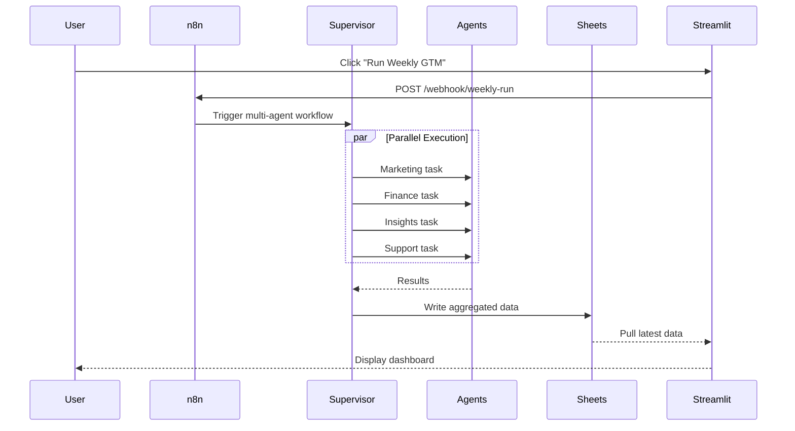
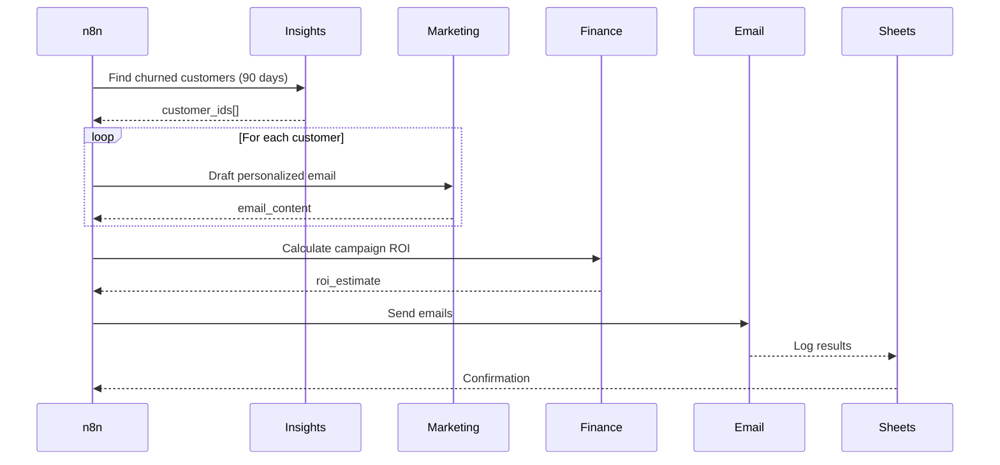

# 🏗️ Two Peaks AI Control Room - Architecture

## Table of Contents
1. [System Overview](#system-overview)
2. [Component Architecture](#component-architecture)
3. [Multi-Agent Orchestration](#multi-agent-orchestration)
4. [Data Flow](#data-flow)
5. [LLM Selection Strategy](#llm-selection-strategy)
6. [Integration Patterns](#integration-patterns)
7. [Deployment Architecture](#deployment-architecture)
8. [Security & Reliability](#security--reliability)
9. [Scaling Considerations](#scaling-considerations)

---

## 1. System Overview

### High-Level Architecture

```
┌─────────────────────────────────────────────────────────────────┐
│                     USER INTERFACE LAYER                         │
│  ┌──────────────────┐              ┌──────────────────┐         │
│  │ Streamlit        │              │ Gradio Support   │         │
│  │ Control Room     │              │ Chat Interface   │         │
│  └────────┬─────────┘              └────────┬─────────┘         │
└───────────┼──────────────────────────────────┼──────────────────┘
            │                                  │
            ▼                                  ▼
┌─────────────────────────────────────────────────────────────────┐
│                  ORCHESTRATION LAYER                             │
│  ┌──────────────────────────────────────────────────────┐       │
│  │              n8n Workflow Engine                      │       │
│  │  • Schedules (daily, weekly runs)                    │       │
│  │  • Event triggers (webhooks, API calls)              │       │
│  │  • Error handling & retry logic                      │       │
│  └────────────────────┬─────────────────────────────────┘       │
└─────────────────────────┼─────────────────────────────────────────┘
                        │
                        ▼
┌─────────────────────────────────────────────────────────────────┐
│              MULTI-AGENT COORDINATION LAYER                      │
│  ┌──────────────────────────────────────────────────────┐       │
│  │            LangGraph Supervisor Agent                 │       │
│  │  • Task routing to specialist agents                 │       │
│  │  • State management across agent interactions        │       │
│  │  • Parallel execution coordination                   │       │
│  │  • Result aggregation                                │       │
│  └────────────────────┬─────────────────────────────────┘       │
└─────────────────────────┼─────────────────────────────────────────┘
                        │
        ┌───────────────┼───────────────┬───────────────┐
        │               │               │               │
        ▼               ▼               ▼               ▼
┌───────────┐   ┌───────────┐   ┌───────────┐   ┌───────────┐
│ Marketing │   │ Finance   │   │ Insights  │   │ Support   │
│ Agent     │   │ Agent     │   │ Agent     │   │ Agent     │
│           │   │           │   │           │   │           │
│ GPT-4     │   │ GPT-3.5   │   │ GPT-4     │   │ GPT-3.5   │
│ Turbo     │   │ Turbo     │   │ Turbo     │   │ + RAG     │
└─────┬─────┘   └─────┬─────┘   └─────┬─────┘   └─────┬─────┘
      │               │               │               │
┌─────────────────────────────────────────────────────────────────┐
│                    INTEGRATION LAYER                             │
│  ┌─────────┐  ┌─────────┐  ┌─────────┐  ┌─────────┐           │
│  │ Email   │  │ Sheets  │  │ CRM     │  │ Vector  │           │
│  │ API     │  │ API     │  │ API     │  │ Store   │           │
│  └─────────┘  └─────────┘  └─────────┘  └─────────┘           │
└─────────────────────────────────────────────────────────────────┘
```

---

## 2. Component Architecture

### 2.1 Streamlit Control Room (`dashboard/`)

**Purpose**: Main user interface for triggering workflows and viewing results.

**Key Features**:
- Multi-page app structure
- Real-time status updates via WebSocket
- Interactive data visualizations (Plotly)
- Agent activity logs
- Manual trigger buttons for workflows

**Components**:
```python
control_room_app.py           # Main entry point
├── components/
│   ├── agent_status.py       # Agent health indicators
│   ├── kpi_cards.py         # Metric cards
│   └── workflow_trigger.py  # Action buttons
└── pages/
    ├── 1_Weekly_GTM.py      # Weekly report page
    ├── 2_Win_Back.py        # Campaign page
    └── 3_Analytics.py       # Historical trends
```

### 2.2 n8n Orchestrator (`orchestration/n8n_workflows/`)

**Purpose**: Workflow automation and scheduling layer.

**Workflows**:

#### **Weekly GTM Run** (`weekly_gtm_run.json`)
```
Trigger: Cron (Monday 9 AM)
  ↓
HTTP Request to LangGraph Supervisor
  ↓
Wait for all agents to complete (parallel)
  ↓
Aggregate results
  ↓
Write to Google Sheets
  ↓
Send Slack notification
```

#### **Win-Back Campaign** (`winback_campaign.json`)
```
Trigger: Manual or API webhook
  ↓
Insights Agent: Find churned customers
  ↓
Marketing Agent: Draft emails (loop for each customer)
  ↓
Finance Agent: Calculate offer ROI
  ↓
Send emails via SendGrid
  ↓
Log to Sheets
```

#### **Support Escalation** (`support_escalation.json`)
```
Trigger: Low confidence from Support Agent
  ↓
Create Zendesk ticket
  ↓
Tag with priority
  ↓
Notify support team
```

### 2.3 LangGraph Multi-Agent System (`agents/`)

**Architecture Pattern**: Supervisor with specialized workers.

#### **Supervisor Agent** (`orchestration/langgraph_supervisor.py`)

```python
from langgraph.graph import StateGraph, END
from typing import TypedDict, Annotated, Sequence
import operator

class AgentState(TypedDict):
    messages: Annotated[Sequence[str], operator.add]
    next_agent: str
    results: dict
    
def supervisor_node(state: AgentState):
    """Routes tasks to appropriate agent"""
    # Analyze task requirements
    # Select agent(s) based on keywords
    # Manage state transitions
    return {"next_agent": "marketing"}

def create_graph():
    workflow = StateGraph(AgentState)
    
    # Add agent nodes
    workflow.add_node("supervisor", supervisor_node)
    workflow.add_node("marketing", marketing_agent_node)
    workflow.add_node("finance", finance_agent_node)
    workflow.add_node("insights", insights_agent_node)
    workflow.add_node("support", support_agent_node)
    
    # Define routing logic
    workflow.add_conditional_edges(
        "supervisor",
        route_to_agent,
        {
            "marketing": "marketing",
            "finance": "finance",
            "insights": "insights",
            "support": "support",
            "end": END
        }
    )
    
    return workflow.compile()
```

#### **Agent Specializations**

**Marketing Agent** (`agents/marketing_agent.py`)
- **LLM**: GPT-4 Turbo (requires creativity + reasoning)
- **Tools**: 
  - `generate_campaign_content()`
  - `analyze_channel_performance()`
  - `draft_email()`
- **Prompts**: `prompts/marketing_prompts.yaml`

**Finance Agent** (`agents/finance_agent.py`)
- **LLM**: GPT-3.5 Turbo (structured calculations)
- **Tools**:
  - `calculate_metrics()`
  - `query_sheets()`
  - `forecast_revenue()`
- **Prompts**: `prompts/finance_prompts.yaml`

**Insights Agent** (`agents/insights_agent.py`)
- **LLM**: GPT-4 Turbo (complex pattern recognition)
- **Tools**:
  - `run_rfm_segmentation()`
  - `predict_churn()`
  - `cohort_analysis()`
- **Prompts**: `prompts/insights_prompts.yaml`

**Support Agent** (`agents/support_agent.py`)
- **LLM**: GPT-3.5 Turbo + RAG (ChromaDB)
- **Tools**:
  - `search_knowledge_base()`
  - `create_ticket()`
  - `calculate_confidence()`
- **Prompts**: `prompts/support_prompts.yaml`

---

## 3. Multi-Agent Orchestration

### Orchestration Patterns

#### **Pattern 1: Parallel Execution** (Weekly GTM Run)
```
Supervisor triggers all agents simultaneously
  ↓
  ├─→ Marketing Agent ─┐
  ├─→ Finance Agent   ─┤
  ├─→ Insights Agent  ─┼─→ Supervisor aggregates results
  └─→ Support Agent   ─┘
```

**Benefits**:
- Faster execution (3-5 minutes vs. 15-20 sequential)
- Independent agent failures don't block others
- Real-time progress updates

**Implementation**:
```python
async def parallel_execution(tasks):
    results = await asyncio.gather(
        marketing_agent.run(),
        finance_agent.run(),
        insights_agent.run(),
        support_agent.run(),
        return_exceptions=True
    )
    return aggregate_results(results)
```

#### **Pattern 2: Sequential with Handoff** (Win-Back Campaign)
```
Insights Agent identifies customers
  ↓ (passes customer_ids)
Marketing Agent drafts emails
  ↓ (passes campaign_cost)
Finance Agent calculates ROI
  ↓
Return to supervisor for execution
```

**Benefits**:
- Clear data dependencies
- Each agent builds on previous results
- Easy to debug and monitor

**State Management**:
```python
class WinBackState(TypedDict):
    churned_customers: List[str]  # From Insights
    email_drafts: Dict[str, str]  # From Marketing
    roi_estimate: float           # From Finance
    execution_status: str
```

#### **Pattern 3: Human-in-the-Loop** (Support Escalation)
```
Support Agent attempts answer
  ↓
If confidence < threshold:
  ↓
Create ticket + notify human
  ↓
Human resolves + updates knowledge base
  ↓
RAG index rebuilt nightly
```

---

## 4. Data Flow

### Weekly GTM Report Flow



### Win-Back Campaign Flow



---

## 5. LLM Selection Strategy

### Decision Matrix

| Agent | LLM | Reasoning |
|-------|-----|-----------|
| **Marketing** | GPT-4 Turbo | • Creative content generation<br>• Nuanced brand voice<br>• A/B test hypotheses |
| **Finance** | GPT-3.5 Turbo | • Structured calculations<br>• Simple queries<br>• Cost optimization |
| **Insights** | GPT-4 Turbo | • Complex pattern recognition<br>• Multi-dimensional segmentation<br>• Predictive reasoning |
| **Support** | GPT-3.5 Turbo | • Fast response time<br>• RAG handles complexity<br>• High volume queries |

### Cost Optimization

**Monthly API Cost Estimate** (1000 employees, 500 customers):

```
Marketing Agent:
- 100 campaigns/month × 2000 tokens × $0.01/1K = $2.00

Finance Agent:
- 50 reports/month × 500 tokens × $0.0005/1K = $0.01

Insights Agent:
- 20 analyses/month × 3000 tokens × $0.01/1K = $0.60

Support Agent:
- 1000 queries/month × 800 tokens × $0.0005/1K = $0.40

Total: ~$3/month (vs. $40K/month for 4 FTEs)
```

---

## 6. Integration Patterns

### Adapter Pattern for Flexibility

All integrations use a common interface:

```python
# integrations/base_adapter.py
from abc import ABC, abstractmethod

class IntegrationAdapter(ABC):
    @abstractmethod
    def connect(self) -> bool:
        """Establish connection"""
        pass
    
    @abstractmethod
    def fetch_data(self, query: dict) -> dict:
        """Retrieve data"""
        pass
    
    @abstractmethod
    def write_data(self, data: dict) -> bool:
        """Write data"""
        pass
```

### Example: CRM Adapter

```python
# integrations/hubspot_adapter.py
class HubSpotAdapter(IntegrationAdapter):
    def __init__(self, api_key: str):
        self.client = HubSpot(api_key=api_key)
    
    def fetch_data(self, query: dict) -> dict:
        if query["type"] == "contacts":
            return self.client.crm.contacts.get_all()
        # ... more query types
    
# Easy to swap:
# integrations/salesforce_adapter.py
class SalesforceAdapter(IntegrationAdapter):
    # Same interface, different implementation
```

---

## 7. Deployment Architecture

### Recommended: Hybrid Architecture

```
┌─────────────────────────────────────────────────────────────┐
│                      PUBLIC LAYER                            │
│  ┌──────────────────────────────────────────────────┐       │
│  │  Vercel Static Site (Free Tier)                  │       │
│  │  • Architecture diagrams                         │       │
│  │  • Demo video embed                              │       │
│  │  • ROI calculator (static JS)                    │       │
│  │  • "Request Demo" form                           │       │
│  └──────────────────────────────────────────────────┘       │
└─────────────────────────────────────────────────────────────┘
                           │
                           │ (Password protected link)
                           ▼
┌─────────────────────────────────────────────────────────────┐
│                   DEMO LAYER (Controlled)                    │
│  ┌──────────────────────────────────────────────────┐       │
│  │  Streamlit Community Cloud                       │       │
│  │  • Built-in authentication                       │       │
│  │  • Demo mode with cached responses               │       │
│  │  • Read-only database                            │       │
│  └──────────────────────────────────────────────────┘       │
└─────────────────────────────────────────────────────────────┘
                           │
                           │ (Real API calls, scheduled)
                           ▼
┌─────────────────────────────────────────────────────────────┐
│              PRODUCTION LAYER (Private)                      │
│  ┌──────────────────────────────────────────────────┐       │
│  │  Docker Container on Cloud Run / Railway         │       │
│  │  • Full agent system                             │       │
│  │  • n8n workflows                                 │       │
│  │  • Live integrations                             │       │
│  └──────────────────────────────────────────────────┘       │
└─────────────────────────────────────────────────────────────┘
```

### Demo Mode Implementation

```python
# dashboard/control_room_app.py
import os

DEMO_MODE = os.getenv("DEMO_MODE", "false").lower() == "true"

if DEMO_MODE:
    # Use cached responses
    from demo_data import cached_responses
    results = cached_responses["weekly_gtm"]
else:
    # Make real API calls
    results = agent_system.run_weekly_gtm()
```

---

## 8. Security & Reliability

### Security Measures

1. **API Key Management**
   - Environment variables only (never committed)
   - Separate keys for dev/staging/prod
   - Rotation every 90 days

2. **Authentication**
   - Streamlit built-in auth for demo
   - OAuth for production (Google/Microsoft)
   - Rate limiting per user

3. **Data Privacy**
   - PII anonymization in logs
   - Encrypted at rest (Google Sheets encryption)
   - GDPR-compliant data retention

### Reliability Patterns

1. **Retry Logic**
```python
from tenacity import retry, stop_after_attempt, wait_exponential

@retry(
    stop=stop_after_attempt(3),
    wait=wait_exponential(multiplier=1, min=4, max=10)
)
def call_llm(prompt: str):
    return openai.ChatCompletion.create(...)
```

2. **Circuit Breaker**
```python
from pybreaker import CircuitBreaker

breaker = CircuitBreaker(fail_max=5, timeout_duration=60)

@breaker
def call_external_api():
    # If 5 failures in 60 seconds, stop trying
    pass
```

3. **Graceful Degradation**
```python
def get_customer_data():
    try:
        return crm_api.fetch()
    except APIError:
        # Fall back to cached data
        return cache.get("last_known_customers")
```

---

## 9. Scaling Considerations

### Current Capacity (Single Instance)

- **Concurrent Users**: 10-20
- **Agents per minute**: 5-10 runs
- **Data volume**: 1-5K customers, 10-50K orders

### Scaling Strategies

#### **Horizontal Scaling** (1K+ users)
```
Load Balancer
  ↓
├─→ Streamlit Instance 1
├─→ Streamlit Instance 2
└─→ Streamlit Instance 3
  ↓
Shared Redis Cache
  ↓
Agent Worker Pool (Celery)
```

#### **Database Optimization** (100K+ customers)
- Migrate from Google Sheets → PostgreSQL
- Add caching layer (Redis)
- Implement pagination for large queries

#### **LLM Cost Management** (High volume)
- Implement prompt caching (OpenAI native caching)
- Use fine-tuned models for repetitive tasks
- Batch similar queries

---

## Appendix: Key Files Reference

| File | Purpose |
|------|---------|
| `dashboard/control_room_app.py` | Main Streamlit entry point |
| `orchestration/langgraph_supervisor.py` | Multi-agent coordinator |
| `agents/marketing_agent.py` | Marketing specialist |
| `agents/finance_agent.py` | Finance specialist |
| `agents/insights_agent.py` | Customer insights specialist |
| `agents/support_agent.py` | Support + RAG specialist |
| `integrations/sheets_adapter.py` | Google Sheets integration |
| `support_agent/build_index.py` | RAG embeddings builder |
| `prompts/*.yaml` | Agent prompt templates |
| `policies/*.yaml` | Configuration & thresholds |

---

**Questions?** See main [README.md](README.md) or open an issue.
