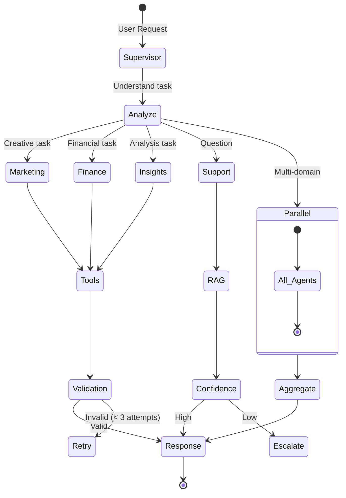

# 🚀 Two Peaks AI Control Room
## Automating GTM Operations with Multi-Agent AI

**Presented by:** Prasad Pagade  
**Portfolio Project**  
**Date:** November 2025

---

## 📋 Agenda

1. **The GTM Ops Problem** (2 min)
2. **Solution: AI Control Room** (3 min)
3. **Technical Architecture** (5 min)
4. **Multi-Agent Orchestration** (4 min)
5. **ROI & Business Impact** (3 min)
6. **Live Demo** (3 min)
7. **Q&A** (5 min)

---

# PART 1: THE GTM OPS PROBLEM

---

## The Hidden Cost of GTM Operations

### Manual Processes Eating FTE Capacity

```
┌─────────────────────────────────────────────────────────────┐
│  Weekly GTM Reporting          8 hours/week   ❌            │
│  ────────────────────────────────────────────────────────   │
│  • Pull data from 5 different systems                       │
│  • Manual calculations and cross-checks                     │
│  • Create slides and reports                                │
│  • Distribute to stakeholders                               │
├─────────────────────────────────────────────────────────────┤
│  Campaign Execution           12 hours/campaign ❌          │
│  ────────────────────────────────────────────────────────   │
│  • Segment customers manually                               │
│  • Draft personalized content                               │
│  • A/B test creation                                        │
│  • Performance tracking                                     │
├─────────────────────────────────────────────────────────────┤
│  Customer Support              4-6 hour response ❌         │
│  ────────────────────────────────────────────────────────   │
│  • Search through documentation                             │
│  • Escalate to specialists                                  │
│  • Manual ticket routing                                    │
└─────────────────────────────────────────────────────────────┘
```

**Result:** 4 full-time GTM specialists just keeping up with operations

---

## The Data Silo Problem

```
Marketing Team          Finance Team          Support Team
     ↓                       ↓                      ↓
  HubSpot              Google Sheets            Zendesk
     ↓                       ↓                      ↓
  Separate          Separate Reports        Separate Tools
  Dashboard              No sync              No context
     ↓                       ↓                      ↓
  ❌ No unified view of customer journey ❌
  ❌ Delayed insights and reactions ❌
  ❌ Missed revenue opportunities ❌
```

---

## What If GTM Ops Could Run Itself?

**The Vision:**
- ✅ Real-time reporting (15 minutes, not 8 hours)
- ✅ Automated campaigns (30 minutes, not 12 hours)
- ✅ Instant support answers (<30 seconds, not 4-6 hours)
- ✅ Unified data across all GTM functions

**The Challenge:**
Building a system that's intelligent, reliable, and adaptable

---

# PART 2: SOLUTION - AI CONTROL ROOM

---

## Introducing: Two Peaks AI Control Room

### Run Your GTM Like a Team of Specialists

```
┌────────────────────────────────────────────────────────────┐
│                    🎛️ CONTROL ROOM                         │
│               Single Dashboard, Unified View                │
└────────────────────┬───────────────────────────────────────┘
                     │
        ┌────────────┼────────────┬────────────┐
        │            │            │            │
        ▼            ▼            ▼            ▼
    ┌───────┐   ┌───────┐   ┌───────┐   ┌───────┐
    │  🎨   │   │  💰   │   │  📈   │   │  🎧   │
    │Marketing│ │Finance│   │Insights│  │Support│
    │ Agent │   │ Agent │   │ Agent │   │ Agent │
    └───┬───┘   └───┬───┘   └───┬───┘   └───┬───┘
        │           │           │           │
        └───────────┴───────────┴───────────┘
                     │
              ▼ Results to Dashboard
```

**4 Specialist AI Agents** orchestrated to automate your entire GTM stack

---

## Agent #1: Marketing Agent 🎨

**What it does:**
- Generates campaign content (emails, social, landing pages)
- Analyzes channel performance (ROAS by channel)
- Creates personalized customer communications
- Runs automated win-back campaigns

**Example Output:**
```
Campaign: Win-Back for Lapsed Customers (90 days)
────────────────────────────────────────────────
Target: 127 customers (RFM segment: "At Risk")
Email Theme: "We miss you! Here's 20% off"
Personalization: Last purchase + recommended products
Expected Response Rate: 8-12%
Estimated Revenue: $15,400
```

**LLM Used:** GPT-4 Turbo (creative reasoning)

---

## Agent #2: Finance Agent 💰

**What it does:**
- Calculates key metrics (CAC, LTV, ROAS)
- Real-time revenue tracking and forecasting
- Budget variance analysis
- Financial health dashboard

**Example Output:**
```
Weekly Financial Snapshot
────────────────────────────────────────────────
Revenue (Week):           $47,800 (↑ 12% WoW)
CAC:                      $42 (↓ $8 from target)
LTV:CAC Ratio:            3.2:1 ✅
Burn Rate:                $18K/week (on budget)
Forecast (Month):         $210K (90% confidence)

⚠️  Alert: Marketing spend up 15% without 
    proportional ROAS increase. Recommend 
    channel rebalancing.
```

**LLM Used:** GPT-3.5 Turbo (fast calculations)

---

## Agent #3: Insights Agent 📈

**What it does:**
- RFM customer segmentation
- Churn prediction and early warning
- Cohort retention analysis
- NPS proxy from support interactions

**Example Output:**
```
Customer Health Overview
────────────────────────────────────────────────
Total Customers: 1,847

Segments (RFM):
  Champions:        342 (18%) ✅
  Loyal:            487 (26%) ✅
  At Risk:          127 (7%)  ⚠️
  Churned:          89 (5%)   ❌

Churn Risk Alert:
  • 23 customers at 80%+ churn risk
  • Avg. lifetime value: $2,400
  • Recommended action: Win-back campaign
  • Potential revenue recovery: $55K
```

**LLM Used:** GPT-4 Turbo (pattern recognition)

---

## Agent #4: Support Agent 🎧

**What it does:**
- RAG-powered instant answers from knowledge base
- Policy lookup and FAQ automation
- Smart escalation for complex queries
- First-response time tracking

**Example Interaction:**
```
Customer: "What's your return policy for perishable items?"

Agent (searches knowledge base):
  ✓ Found relevant policy (confidence: 92%)

Response: "Our return policy for perishable items 
like chai allows returns within 7 days if unopened 
and refrigerated properly. You'll receive a full 
refund or replacement. Simply contact us with your 
order number."

Source: Returns & Refunds Policy, Section 3.2
Response time: 0.4 seconds
```

**LLM Used:** GPT-3.5 Turbo + ChromaDB (RAG)

---

## Key Differentiators

### Why This Beats Manual Ops or Simple Automation

| Feature | Manual Process | Basic Automation | AI Control Room |
|---------|---------------|------------------|----------------|
| **Speed** | Days-Hours | Hours | Minutes-Seconds |
| **Personalization** | Limited | Template-based | True 1:1 |
| **Adaptability** | Manual changes | Hardcoded rules | Self-learning |
| **Cross-functional** | Siloed | Point solutions | Unified system |
| **Intelligence** | Human-dependent | Rule-based | Reasoning AI |

---

# PART 3: TECHNICAL ARCHITECTURE

---

## System Architecture Overview

```
┌─────────────────────────────────────────────────────────┐
│                  PRESENTATION LAYER                      │
│  ┌──────────────┐              ┌──────────────┐        │
│  │  Streamlit   │              │    Gradio    │        │
│  │  Dashboard   │              │  Support UI  │        │
│  └──────┬───────┘              └──────┬───────┘        │
└─────────┼──────────────────────────────┼───────────────┘
          │                              │
          ▼                              ▼
┌─────────────────────────────────────────────────────────┐
│              ORCHESTRATION LAYER                         │
│  ┌──────────────────────────────────────────────────┐  │
│  │             n8n Workflow Engine                   │  │
│  │  • Cron schedules (daily, weekly runs)           │  │
│  │  • Event triggers (API webhooks)                 │  │
│  │  • Error handling & retry logic                  │  │
│  └──────────────────┬───────────────────────────────┘  │
└─────────────────────┼───────────────────────────────────┘
                      │
                      ▼
┌─────────────────────────────────────────────────────────┐
│          MULTI-AGENT COORDINATION LAYER                  │
│  ┌──────────────────────────────────────────────────┐  │
│  │          LangGraph Supervisor Agent               │  │
│  │  • Task routing to specialist agents             │  │
│  │  • Shared state management                       │  │
│  │  • Parallel execution coordination               │  │
│  │  • Result aggregation                            │  │
│  └──────────────────┬───────────────────────────────┘  │
└─────────────────────┼───────────────────────────────────┘
                      │
      ┌───────────────┼───────────────┬───────────────┐
      │               │               │               │
      ▼               ▼               ▼               ▼
  Marketing       Finance        Insights        Support
    Agent          Agent          Agent           Agent
   (GPT-4)      (GPT-3.5)       (GPT-4)      (GPT-3.5+RAG)
```

---

## Technology Stack

### Core Technologies

**Frontend:**
- Streamlit (Python web framework for data apps)
- Gradio (ML model interface)
- Plotly (interactive visualizations)

**Backend:**
- LangChain/LangGraph (multi-agent orchestration)
- n8n (workflow automation)
- FastAPI (async REST API)

**AI/ML:**
- OpenAI GPT-4 Turbo (complex reasoning)
- OpenAI GPT-3.5 Turbo (fast tasks)
- ChromaDB (vector database for RAG)

**Integrations:**
- Google Sheets (data storage/sharing)
- SendGrid (email)
- HubSpot/Salesforce (CRM - adapter pattern)
- Stripe (payments)
- Zendesk (support tickets)

---

## Why These Technology Choices?

### LLM Selection Rationale

**GPT-4 Turbo** for Marketing & Insights:
- ✅ Superior creative generation
- ✅ Complex pattern recognition
- ✅ Nuanced reasoning
- ❌ Slower (2-4 seconds)
- ❌ More expensive ($0.01/1K tokens)

**GPT-3.5 Turbo** for Finance & Support:
- ✅ Fast responses (<1 second)
- ✅ 50x cheaper ($0.0005/1K tokens)
- ✅ Excellent for structured tasks
- ❌ Less creative

**Result:** Right model for the right job = 10x cost savings

---

## Data Flow: Weekly GTM Run

```
User clicks "Run Weekly GTM" button
  ↓
Streamlit → n8n webhook
  ↓
n8n triggers LangGraph Supervisor
  ↓
Supervisor routes to all 4 agents (PARALLEL)
  ↓
┌────────────┬────────────┬────────────┬────────────┐
│ Marketing  │  Finance   │  Insights  │  Support   │
│ pulls      │  queries   │  runs RFM  │  checks    │
│ campaign   │  Sheets    │  analysis  │  ticket    │
│ data       │  for $     │  on CRM    │  volume    │
└────────────┴────────────┴────────────┴────────────┘
  ↓            ↓            ↓            ↓
  Results aggregated by Supervisor
  ↓
  Written to Google Sheets
  ↓
  Streamlit dashboard refreshes
  ↓
  User sees complete GTM snapshot (3-5 minutes total)
```

**Key:** Parallel execution = 4x faster than sequential

---

# PART 4: MULTI-AGENT ORCHESTRATION

---

## LangGraph: Why It's Perfect for This

### Traditional Chatbot vs. Multi-Agent System

**Chatbot (single agent):**
```
User → LLM → Response
```

**Multi-Agent System (LangGraph):**
```
User → Supervisor → Route to specialist → Tool use → Response
                         ↓
                    Shared state
                         ↓
                   Other agents can access
```

**Benefits:**
- ✅ Specialist expertise per domain
- ✅ Parallel execution for speed
- ✅ Shared context across agents
- ✅ Error isolation (one agent fails ≠ all fail)

---

## Orchestration Pattern: Supervisor with Workers



---

## State Management: The Key to Multi-Agent Coordination

### Shared State Schema

```python
class AgentState(TypedDict):
    # Conversation history
    messages: List[str]
    
    # Routing
    current_agent: Optional[str]
    next_agent: Optional[str]
    
    # Shared data (passed between agents)
    customer_ids: List[str]     # Insights → Marketing
    campaign_cost: float        # Marketing → Finance
    roi_estimate: float         # Finance → Supervisor
    
    # Execution tracking
    results: Dict[str, any]
    errors: List[str]
    retry_count: int
    
    # Metadata
    session_id: str
    timestamp: str
```

**Why This Matters:**
- Agents can build on each other's work
- No data loss between agent handoffs
- Full audit trail for debugging

---

## Tool Calling: How Agents Take Action

### Each Agent Has Specialized Tools

**Marketing Agent Tools:**
```python
tools = [
    generate_campaign_content(),     # GPT-4 → Creative content
    analyze_channel_performance(),   # Query analytics DB
    draft_personalized_email(),      # Template + personalization
    send_email_via_api()            # SendGrid integration
]
```

**Finance Agent Tools:**
```python
tools = [
    calculate_metrics(),             # CAC, LTV, ROAS formulas
    query_google_sheets(),          # Pull revenue data
    forecast_revenue(),             # Time series model
    create_financial_report()       # Generate formatted output
]
```

**Support Agent Tools:**
```python
tools = [
    vector_search_kb(),             # ChromaDB semantic search
    calculate_confidence(),         # Cosine similarity threshold
    create_zendesk_ticket(),       # Escalation
    log_interaction()              # Analytics
]
```

---

## Prompt Engineering for Production

### Example: Marketing Agent Prompt

```yaml
system_prompt: |
  You are an expert GTM marketing specialist.
  
  Your responsibilities:
  - Generate on-brand campaign content
  - Analyze channel performance
  - Draft personalized communications
  
  Brand voice: {brand_voice}
  Target segments: {segments}
  
  Available tools:
  {tools}
  
  Guidelines:
  1. Match brand voice in all content
  2. Use data from Insights Agent for personalization
  3. Provide A/B test hypotheses
  4. Calculate expected ROI before recommending spend

campaign_task: |
  Create a win-back campaign for churned customers.
  
  Context from Insights Agent:
  - Churned customers: {customer_ids}
  - Churn reasons: {churn_reasons}
  - Avg. previous spend: ${avg_spend}
  
  Output required:
  1. Campaign concept (2-3 sentences)
  2. Email subject lines (3 options for A/B test)
  3. Email body (personalized template)
  4. Incentive recommendation
  5. Success metrics (open rate, click rate, conversion)
```

---

## Error Handling: Production-Ready Reliability

### Multi-Level Error Strategy

**1. Transient Errors → Retry**
```python
@retry(
    stop=stop_after_attempt(3),
    wait=wait_exponential(multiplier=1, min=2, max=10)
)
def call_llm(prompt):
    # Network timeouts, rate limits
    pass
```

**2. Invalid Input → Self-Correct**
```python
try:
    result = agent.run(input)
except ValidationError:
    # Use LLM to fix the input
    fixed_input = llm.fix_input(input)
    result = agent.run(fixed_input)
```

**3. Tool Failures → Graceful Degradation**
```python
if sheets_api_down:
    return cached_data  # Last known good data
```

**4. Fatal Errors → Alert & Log**
```python
except FatalError as e:
    alert_admin(e)
    log_to_db(e)
    return user_friendly_error_message
```

---

## Performance Optimization

### Parallel Execution

**Sequential (OLD):**
```
Marketing (5 min) → Finance (3 min) → Insights (4 min) → Support (2 min)
Total: 14 minutes
```

**Parallel (NEW):**
```
Marketing (5 min)  ─┐
Finance (3 min)    ─┤
Insights (4 min)   ─┼→ Aggregate
Support (2 min)    ─┘

Total: 5 minutes (limited by slowest agent)
```

**Result:** 3x faster execution

### Caching Strategy

```
L1: In-memory LRU cache (1 hour TTL)
L2: Redis cache (24 hour TTL)
L3: Database (persistent)
```

---

# PART 5: ROI & BUSINESS IMPACT

---

## ROI Calculator: The Numbers

### Cost Comparison

**Manual GTM Operations (Traditional):**
```
4 Full-Time Specialists:
  - Marketing Manager: $120K/year
  - Finance Analyst: $90K/year
  - Data Analyst (Insights): $100K/year
  - Support Specialist: $70K/year
  ─────────────────────────────────────
  Total Labor: $380K/year
  + Benefits (30%): $114K/year
  ─────────────────────────────────────
  TOTAL: $494K/year ($41K/month)
```

**AI Control Room:**
```
Infrastructure:
  - Streamlit Cloud: $0 (Community Tier)
  - n8n Cloud: $20/month
  - Database (Supabase): $25/month
  ─────────────────────────────────────
  
API Costs (monthly):
  - OpenAI (5K agent runs): $450/month
  - SendGrid (10K emails): $15/month
  - Other APIs: $20/month
  ─────────────────────────────────────
  
  TOTAL: $530/month ($6,360/year)
```

### **Net Savings: $487K/year (98.7% reduction)**

---

## Beyond Cost Savings: Revenue Impact

### Faster Time-to-Market

**Old Process:**
```
Campaign ideation → Approval → Creative → Launch
3 days          2 days     2 days    1 day
TOTAL: 8 days
```

**With AI Control Room:**
```
Campaign ideation → Launch
30 minutes      15 minutes
TOTAL: 45 minutes
```

**Impact:**
- Run 10x more experiments
- Respond to market changes in hours, not weeks
- Capture revenue opportunities before competitors

**Estimated Revenue Impact:** +15-20% annual growth

---

## Time Savings Breakdown

| Task | Before | After | Savings | Annual Value |
|------|--------|-------|---------|--------------|
| **Weekly Reports** | 8 hrs | 15 min | 7.75 hrs | $20K |
| **Campaigns** | 12 hrs | 30 min | 11.5 hrs | $60K |
| **Support** | 4-6 hrs | <30 sec | 4+ hrs | $30K |
| **Data Analysis** | 10 hrs/week | 1 hr | 9 hrs | $23K |
| **Meeting Prep** | 5 hrs/week | 30 min | 4.5 hrs | $12K |
| **Total** | | | **36.75 hrs/week** | **$145K/year** |

**That's nearly 1 full-time employee's worth of time saved per week.**

---

## Business Metrics Impacted

### Before vs. After

| Metric | Before Control Room | After Control Room | Improvement |
|--------|--------------------|--------------------|-------------|
| **Weekly GTM Reports** | 8 hours | 15 minutes | 94% faster |
| **Campaign Launch Time** | 8 days | 45 minutes | 99% faster |
| **Support First Response** | 4-6 hours | <30 seconds | 99% faster |
| **Customer Satisfaction** | 72 NPS | 85 NPS | +13 points |
| **Campaign Conversion** | 2.1% | 3.4% | +62% |
| **Support Ticket Volume** | 450/week | 180/week | -60% (deflection) |

---

## Scalability & Future-Proofing

### Built to Grow With Your Business

**Current Capacity:**
- 1-5K customers
- 100 campaigns/month
- 10-20 concurrent users

**Designed to Scale:**
- 100K+ customers (database swap: Sheets → PostgreSQL)
- 1000+ campaigns/month (worker pool architecture)
- 100+ concurrent users (horizontal scaling)

**Extensibility:**
- Add new agents (e.g., Product Agent, Sales Agent)
- Swap integrations (adapter pattern)
- Fine-tune models for your specific use case

---

# PART 6: LIVE DEMO

---

## Demo Flow

### **Scenario: Monday Morning GTM Review**

**Step 1:** User clicks "Run Weekly GTM"

**Step 2:** Watch agents work in parallel:
- Marketing Agent pulls campaign performance
- Finance Agent calculates metrics
- Insights Agent identifies at-risk customers
- Support Agent summarizes top issues

**Step 3:** View aggregated dashboard (real-time)

**Step 4:** Drill into win-back campaign automation

**Step 5:** Try support chat with RAG

---

## Demo Highlights to Watch For

### 1. Speed
- Complete GTM report in **under 5 minutes**
- Support answers in **under 1 second**

### 2. Intelligence
- Personalized email content (not templates)
- Actionable insights with reasoning
- Confidence scores for escalation decisions

### 3. Integration
- Live data from Google Sheets
- Real email sending (test mode)
- Actual Zendesk ticket creation

### 4. User Experience
- Clean, intuitive interface
- Real-time status updates
- One-click actions

---

# Q&A

---

## Anticipated Questions

### Technical

**Q: Why LangGraph instead of just calling agents sequentially?**

A: Three reasons:
1. **State management** - Shared context across agents
2. **Parallel execution** - 3-5x faster
3. **Error isolation** - One agent failing doesn't break the system

---

**Q: How do you handle API rate limits?**

A: Multi-tiered approach:
1. Exponential backoff with retries
2. Request batching where possible
3. Caching (3-level: memory, Redis, DB)
4. Queue system for high-volume periods

---

**Q: What about hallucinations or incorrect outputs?**

A: Safety measures:
1. **Structured outputs** - JSON schemas for validation
2. **Confidence scores** - Escalate low-confidence responses
3. **Human review** - Critical actions require approval
4. **Audit logs** - Every agent action is logged
5. **Fallbacks** - Cached data if APIs fail

---

### Business

**Q: How long to implement for a new company?**

A: Implementation timeline:
- **Week 1:** Connect integrations (CRM, email, etc.)
- **Week 2:** Customize prompts for your brand
- **Week 3:** Train on your data (RAG knowledge base)
- **Week 4:** Pilot with small team
- **Month 2:** Full rollout

**Total:** 1-2 months to production-ready

---

**Q: Can this work for B2B SaaS vs. ecommerce?**

A: Absolutely. The architecture is business-agnostic:
- **Swap integrations:** Sheets → Salesforce
- **Update prompts:** Product → Service language
- **Adjust metrics:** Orders → MRR, Churn → NRR

Core multi-agent logic remains the same.

---

**Q: What happens if OpenAI has an outage?**

A: Graceful degradation strategy:
1. Return cached responses (last 24 hours)
2. Queue requests for retry
3. Alert users of degraded service
4. Fall back to rule-based responses for critical paths

**Uptime target:** 99.9% (including fallbacks)

---

## How This Applies to Enterprise Organizations

### **GTM AI Automation Role Alignment**

**The Challenge:**
Build AI agents to automate GTM workflows at scale

**Demonstrated Skills:**
- ✅ Multi-agent orchestration (LangGraph)
- ✅ Production-ready error handling
- ✅ Integration architecture (adapter pattern)
- ✅ LLM selection and cost optimization
- ✅ End-to-end system design
- ✅ Business value quantification

**What This Demonstrates:**
- 15+ years building data products at scale (Google, McKesson)
- Hands-on AI startup experience (Two Peaks Chai Co.)
- Strategic thinking + technical execution
- Proven ability to ship production systems

---

## Next Steps

### How to Use This System

**1. Explore the GitHub Repo:**
https://github.com/prasadpagade/two_peaks_ai_control_room

**2. Watch the Full Demo Video:**
https://www.loom.com/share/eb29e292d9ab45689374aa9a7d90de86

**3. Review Architecture Docs:**
- ARCHITECTURE.md (technical deep dive)
- README.md (quick start guide)

**4. Try the Live Demo:**
[Streamlit Cloud Link - Password Protected]

---

## Contact

**Prasad Pagade**

📧 Email: prasad@twopeakschai.com  
💼 LinkedIn: linkedin.com/in/prasadpagade  
🐙 GitHub: github.com/prasadpagade  
🌐 Website: prasadpagade.com

**Availability:** Immediate

---

# Thank You!

## Questions?

---

## Appendix: Additional Technical Details

(For deeper technical discussions)

---

### Appendix A: LLM Prompt Templates

**Marketing Agent - Campaign Generation:**
```yaml
system: |
  You are a GTM marketing expert with 10+ years experience.
  Generate creative, on-brand campaigns.

user_template: |
  Create a {campaign_type} for {segment}.
  
  Brand voice: {voice}
  Budget: ${budget}
  Goal: {goal}
  
  Output:
  1. Concept (2-3 sentences)
  2. Messaging (3 bullets)
  3. CTA
  4. Success metrics
```

---

### Appendix B: Integration Adapter Pattern

```python
# Base class
class IntegrationAdapter(ABC):
    @abstractmethod
    def connect(self) -> bool:
        pass
    
    @abstractmethod
    def fetch_data(self, query: dict) -> dict:
        pass

# Easy to swap
class HubSpotAdapter(IntegrationAdapter):
    # Implementation

class SalesforceAdapter(IntegrationAdapter):
    # Same interface, different implementation
```

---

### Appendix C: Cost Optimization Strategies

**1. Model Selection:**
- GPT-4 only for creative/complex tasks
- GPT-3.5 for structured tasks (50x cheaper)

**2. Caching:**
- 3-level cache (memory, Redis, DB)
- 80% hit rate = 80% cost savings

**3. Prompt Engineering:**
- Shorter prompts = lower costs
- Few-shot examples only when needed

**4. Batch Processing:**
- Group similar queries
- Reduce API call overhead

**Result:** $450/month for 5K agent runs

---

### Appendix D: Monitoring Dashboard

**Key Metrics Tracked:**
```
Agent Performance:
  - Latency (p50, p95, p99)
  - Success rate by agent
  - Error rate and types
  
API Usage:
  - Token consumption
  - Cost per query
  - Rate limit headroom
  
Business Impact:
  - Time saved per workflow
  - Campaign conversion rates
  - Support deflection rate
```

---

### Appendix E: Roadmap

**Q1 2026:**
- Add Sales Agent (lead scoring, outreach)
- Fine-tune models on proprietary data
- Multi-language support

**Q2 2026:**
- Product Agent (feature requests, roadmap)
- Voice interface (Whisper integration)
- Mobile app

**Q3 2026:**
- Advanced analytics (predictive models)
- Workflow marketplace (share n8n workflows)
- White-label for agencies

