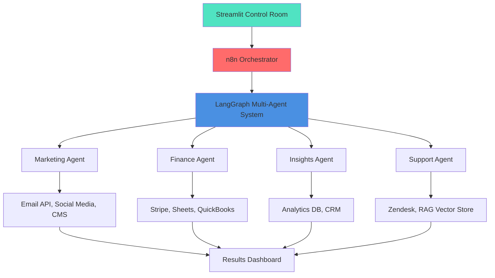

# 🚀 Two Peaks AI Control Room

[](https://opensource.org/licenses/MIT)
[](https://www.python.org/downloads/)
[](https://streamlit.io)
[](https://langchain.com)
[](https://openai.com)

> **Run your GTM operations like a team of specialists** — Marketing, Finance, Customer Insights, and Support agents collaborating through an intelligent control room.

**Built for SMB/Mid-Market businesses** to achieve 4 FTEs worth of leverage through AI automation.

---

## 📊 **Business Impact**

| Metric | Manual Process | With AI Control Room | Savings |
|--------|---------------|---------------------|---------|
| Weekly GTM Reports | 8 hrs/week | 15 min/week | **~94%** |
| Win-Back Campaigns | 12 hrs/campaign | 30 min/campaign | **~96%** |
| Support Response Time | 4-6 hours | < 30 seconds | **~99%** |
| **Total FTE Savings** | - | - | **≈ 4 FTEs** |

### **ROI Calculator**
```
Monthly Cost Breakdown:
- 4 Full-Time GTM Specialists: $40,000/month
- AI Control Room (API + Hosting): $800/month
- Net Savings: $39,200/month (98% reduction)
```

---

## 🎯 **What It Does**

The **Two Peaks AI Control Room** orchestrates four specialized AI agents that automate your entire GTM operations stack:

### **🎨 Marketing Agent**
- Generates campaign content (emails, social posts, landing pages)
- A/B testing recommendations
- Channel-specific ROAS analysis
- Automated win-back campaigns for lapsed customers

### **💰 Finance Agent**
- Real-time revenue tracking and forecasting
- CAC/LTV calculations by cohort
- Budget variance analysis
- Financial health dashboard

### **📈 Customer Insights Agent**
- RFM segmentation (Recency, Frequency, Monetary)
- Churn prediction and early warning signals
- NPS proxy scoring from support interactions
- Cohort retention analysis

### **🎧 Support Agent**
- RAG-powered instant answers from knowledge base
- Policy lookup and FAQ automation
- Escalation routing for complex queries
- First-response time tracking

---

## 🏗️ **Architecture**



**Key Technologies:**
- **Orchestration**: n8n (workflow automation)
- **Multi-Agent Framework**: LangGraph (stateful agent routing)
- **LLMs**: OpenAI GPT-4 (complex reasoning), GPT-3.5-turbo (simple tasks)
- **Vector Store**: ChromaDB (RAG for support agent)
- **UI**: Streamlit (main dashboard) + Gradio (support chat)
- **Integrations**: Google Sheets, Stripe, HubSpot/Salesforce (adaptable)

---

## 🚀 **Quick Start**

### **Prerequisites**
- Python 3.10+
- OpenAI API Key
- Google Cloud Service Account (for Sheets integration)
- n8n instance (self-hosted or cloud)

### **Installation**

1. **Clone the repository**
```bash
git clone https://github.com/prasadpagade/two_peaks_ai_control_room.git
cd two_peaks_ai_control_room
```

2. **Set up virtual environment**
```bash
python -m venv venv
source venv/bin/activate  # On Windows: venv\Scripts\activate
pip install -r requirements.txt
```

3. **Configure environment variables**
```bash
cp .env.example .env
# Edit .env with your API keys:
# OPENAI_API_KEY=your_openai_key
# GOOGLE_SHEETS_CREDS=path/to/service_account.json
# N8N_WEBHOOK_URL=your_n8n_webhook
```

4. **Initialize RAG index for Support Agent**
```bash
python support_agent/build_index.py
```

5. **Run the Control Room**
```bash
streamlit run dashboard/control_room_app.py
```

6. **Access the dashboard**
```
http://localhost:8501
```

---

## 🧪 **Demo Workflows**

### **1. Weekly GTM Run**
Triggers all agents in parallel to generate a comprehensive business overview:
- Marketing: Channel performance, campaign recommendations
- Finance: Revenue trends, budget utilization
- Insights: Customer segment health, churn risks
- Support: Top issues, knowledge gaps

**Trigger**: `POST /api/weekly-run` or click "Run Weekly GTM" in dashboard

### **2. Win-Back Campaign**
Automated end-to-end campaign for lapsed customers:
1. **Insights Agent** identifies churned customers from last 90 days
2. **Marketing Agent** drafts personalized win-back emails
3. **Finance Agent** calculates win-back offer ROI
4. Results logged to Google Sheets

**Trigger**: `POST /api/winback-campaign` or "Start Win-Back" button

### **3. Support Q&A**
RAG-powered instant support with escalation:
1. User asks question via Gradio chat
2. **Support Agent** searches knowledge base (policies, FAQs)
3. If confidence < 0.7, escalates to ticket system
4. Tracks first-response time

**Trigger**: Navigate to `/support` or use Gradio interface

---

## 📁 **Project Structure**

```
two_peaks_ai_control_room/
├── dashboard/
│   ├── control_room_app.py          # Main Streamlit dashboard
│   ├── components/                   # Reusable UI components
│   └── pages/                        # Multi-page app sections
├── agents/
│   ├── marketing_agent.py
│   ├── finance_agent.py
│   ├── insights_agent.py
│   └── support_agent.py
├── orchestration/
│   ├── langgraph_supervisor.py      # Multi-agent orchestrator
│   └── n8n_workflows/               # n8n workflow JSON exports
├── integrations/
│   ├── sheets_adapter.py
│   ├── stripe_adapter.py
│   ├── hubspot_adapter.py           # Swap for your CRM
│   └── email_adapter.py
├── prompts/
│   ├── marketing_prompts.yaml
│   ├── finance_prompts.yaml
│   ├── insights_prompts.yaml
│   └── support_prompts.yaml
├── policies/
│   ├── escalation_thresholds.yaml
│   └── agent_configs.yaml
├── support_agent/
│   ├── build_index.py               # RAG embeddings builder
│   ├── knowledge_base/              # FAQ docs, policies
│   └── vector_store/                # ChromaDB storage
├── tests/
│   ├── test_agents.py
│   └── test_integrations.py
├── requirements.txt
├── .env.example
├── README.md
└── ARCHITECTURE.md                  # Detailed system design
```

---

## 🔧 **Configuration**

### **Adapting to Your Business**

The system is designed to be **business-agnostic**. Customize via:

#### **1. Swap Integrations** (`integrations/` folder)
Replace adapters with your tools:
- CRM: `hubspot_adapter.py` → `salesforce_adapter.py` or `your_crm_adapter.py`
- Payments: `stripe_adapter.py` → `square_adapter.py`
- Email: `sendgrid_adapter.py` → `mailchimp_adapter.py`

#### **2. Update Prompts** (`prompts/` folder)
Edit YAML files to match your:
- Brand voice
- Product categories
- Business metrics
- Customer segments

#### **3. Adjust Thresholds** (`policies/` folder)
Configure:
- Escalation confidence scores (default: 0.7)
- Alert triggers (e.g., churn risk > 30%)
- Budget variance tolerance

#### **4. n8n Workflows** (`orchestration/n8n_workflows/`)
Import JSON files to your n8n instance and connect webhooks.

---

## 🎓 **Multi-Agent Design Patterns**

This project demonstrates **production-grade multi-agent orchestration**:

### **Supervisor Pattern** (LangGraph)
- Central supervisor routes tasks to specialist agents
- Maintains shared state across agent interactions
- Handles parallel execution for independent tasks

### **Tool Routing**
- Each agent has specialized tools (APIs, databases)
- Dynamic tool selection based on task requirements
- Graceful degradation if tools unavailable

### **State Management**
- LangGraph maintains conversation history
- Agents share context (e.g., customer ID across Marketing + Insights)
- Rollback capability for failed operations

### **RAG Integration**
- Support agent uses semantic search over knowledge base
- Embeddings updated nightly for fresh content
- Hybrid search (vector + keyword) for accuracy

---

## 📊 **KPIs This Automates**

| Category | Metrics |
|----------|---------|
| **Revenue** | Orders, GMV, Revenue by channel |
| **Marketing** | ROAS by channel, CAC, Conversion rates |
| **Finance** | CAC/LTV ratio, Burn rate, Budget variance |
| **Customer Health** | Cohort retention, RFM segments, Churn risk |
| **Support** | First-response time, Resolution rate, NPS proxy |

---

## 🧯 **Troubleshooting**

### **API Key Errors**
```
Error: Missing OPENAI_API_KEY
```
**Fix**: Set environment variable in `.env`:
```bash
OPENAI_API_KEY=sk-proj-...
```

### **Google Sheets Permission Denied**
```
Error: The caller does not have permission
```
**Fix**: Share the spreadsheet with your service account email:
```
your-service-account@project-id.iam.gserviceaccount.com
```

### **RAG Not Retrieving Documents**
```
Warning: No relevant documents found
```
**Fix**: Rebuild embeddings:
```bash
python support_agent/build_index.py
```

### **n8n Webhook Not Responding**
```
Error: Connection refused to n8n
```
**Fix**: Check n8n is running and webhook URL is correct:
```bash
curl -X POST https://your-n8n-instance.com/webhook/weekly-run
```

---

## 🤝 **Contributing**

This is a reference implementation for GTM automation. To adapt:

1. Fork the repository
2. Swap `integrations/` adapters for your tools
3. Update `prompts/` to match your business
4. Test with your data
5. Deploy to your infrastructure

---

## 📄 **License**

MIT License - See [LICENSE](LICENSE) file for details.

---

## 🔗 **Resources**

- **Architecture Deep Dive**: See [ARCHITECTURE.md](ARCHITECTURE.md)
- **Demo Video**: [Loom Walkthrough](https://www.loom.com/share/eb29e292d9ab45689374aa9a7d90de86)
- **LangGraph Docs**: https://langchain-ai.github.io/langgraph/
- **n8n Docs**: https://docs.n8n.io/

---

## 👤 **Author**

**Prasad Pagade**  
AI & Data Products Leader | 15+ Years at Google & McKesson  
[LinkedIn](https://linkedin.com/in/prasadpagade) | [Website](https://prasadpagade.com)

*Built while scaling Two Peaks Chai Co. — a real-world AI-powered business.*

---

## 💬 **Questions?**

- Open an issue for bugs or feature requests
- Discussions for implementation questions
- Email: prasad@twopeakschai.com

---

**⭐ If this helped automate your GTM ops, give it a star!**
